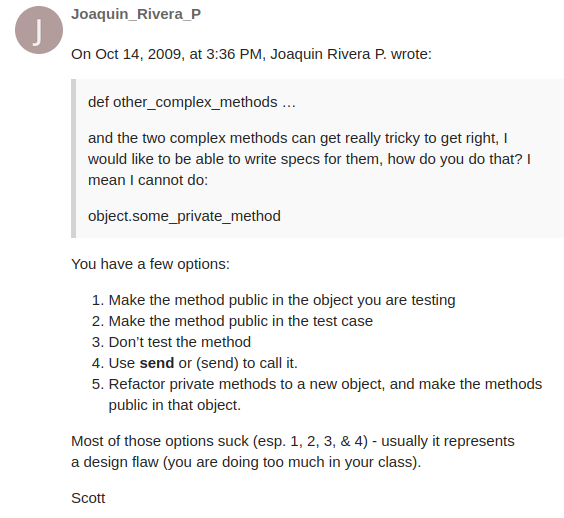
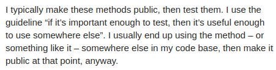

# Testing with `rspec`

I don't think I have to test the `Player` class since it's so simple. I can test the `Inputable` module with the `Game`.

I'll just test the `Game` class.

## `game.spec.rb`

Before I started this lesson I made up a rule I thought would simplify things, and that was to make as much code private as possible.

The advise from the lesson is to not test private methods, or to make more methods public, but that makes the code less clear since I'm certain some of the methods I'd need to test would never be called outside of the class instance in the real world.

Test proponents make it seem like the tediousness of writtin tests is the reason many people skip them, however I think this may be the real reason.

> 5. Refactor private methods to a new object, and make the methods public in that object.

This is like making the methods public in the original class. When the algorithm is tricky but has a very narrow scope, making a new class feels like overkill, and I don't want to make anything but the absolutely necessary available to the public, it's easier to understand a class when it exposes only what's absolutely necessary.

So it "could" be used somewhere, but that's not absolutely certain it will. That makes things ambiguous, and I'd need to think harder about why a method is public.

I'll use `send` to test things.

### `start`

Public script method. It shouldn't be tested, but all methods it calls (just one) should.

### `set_up`

It should set up things properly.

I will stub the `sleep` and `puts` calls. I'll test two things:

1. That the instance variables are given the correct type of values.
2. The correct player is choosen given the result of `@turn = rand 2`.

How do I test the second thing? I can stub `rand` to return whatever I want, and expect the final message to `puts` to be what I expect, but I'm already stubbing `puts`, and I don't care about the other `puts`es.

Looks like I can do [this](./tests/stub_rand.rb).

### `optain_user_input`

It's a wrapper around `get_input` from the `Inputable` module, so the module tests should cover this.

### `terminate`

It's a command method, so logic dictates I should test it, however the method is so short and simple I could just not do it, however the code may change in the future so it may be convenient to do it.

The method is short and simple, so it would be better to only test the methods that depend on it. If I was following the tutorial's guidance of making testable methods public, then this method would be private, and I wouldn't need to test it. I could make my own category of public and private with regards to testing.

Still, the point of tests is that they should make it easier to expand code as they would make it easy to screen for unwanted breaking changes.

How would I even begin to test this? I can't just call the method and check that the state of the object updates to what I expect it to. I mean, I can, but what if the code was more complicated? what if instead of just setting booleans it called other methods that did more stuff. In that case the outcome of calling this method could possibly depend on the previous state of the object. A `Game` instance is initialized with almost random values currently, and it's not properly brought to life until we call `start` on it, so if we assume that the are in the previous situation where `terminate` calls some other methods, then for testing we would need a `before` block that sets up state in a way that would make sense to terminate it. Would that be be accurate to the real world? Would the set up need to be too complex for the test to be accurate? This method feels like it should be a private member of the class, and also private to tests, however I'll test it anyway.

### `update_board`

It feels like a script method. The state changes after the method is called, but it is a different method the one that does the changing. I'll assume the tests for `set` cover it.

### `handle_input`

It feels like a script method, and I don't think I can change the behaviour of the `if` statement, so it feels pointless to test it. I'll do it for completeness, and to practice stubbing.

### `print_scores`

Script method. I don't think I should test a method that just writes to the console. The correctness of the message depends on the correctness of the methods that manipulate state.

### `update_winner`

It changes the score of the winner by one. The players are in the array in the order `[x, o]`, so if I say that the winner is `x`, then this player's score would change by one.

### `print_end_message`

I can test what is printed based on the parameter to the method.

### `update`

Command/script method. I'll check that the correct branch is followed based on whether or not there's a winner.

In the method we first ask the `@board` to compute a winner. If there's one, we stop gaming, and print the end message, otherwise we just change the turn.

How do I stub a call to the `Board` instance?

### `play_again?`

It mostly depends on `get_input`, so I don't think there's any need ot test it.

### `program_loop`

It calls other methods, so it's a script method, but it changes the state, so it's also a command method. There's no much to test, I'd need to stub all method calls.

### `game_loop`

I won't test this either.
