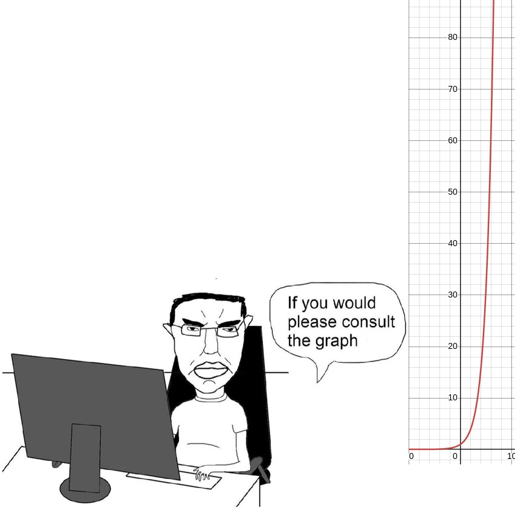

### $1.-$ What is Big O?

$A:$

A way of measuring the efficiency of an algorithm. It tells us how the algorithm would perform in the worst case.

### $2.-$ What are the Big O Notations?

$A:$

- O(1): The time to perform an operation is constant regardless of the input size. Examples of this are getting the element of an array at a given index. It takes the same amount of time regardless of if the array has 10 or 1000000 elements. Another example is getting the value in hash given the key.
- O(log n): The time to perform an operation is directly proportional to the logarithm base 2 of the size of the input. An example is binary search.
- O(n): Time is proportional to the size of the input. An example is adding all numbers in an array.
- O(n ** x): The time to perform an operation is directly proportional to the xth power of the size of the input. If we loop through all elements of an array that's O(n). If we nest a loop inside the previous one, we are now looping n \* n times, so the time complexity is O(n ** 2). If we nest another loop inside the previously nested one we now have O(n ** 3), and so on. This type of time complexity should be avoided as much as possible. If we have a time complexity of O(n ** 2) then an input of just ten thousand elements (something reasonable in a boids simulation) would require one hundred million iterations.
- O(a ** n): This is worse than the previous one. The graph below shows 2 ** x, we can see that it grows extremely fast. An example where this would arise is when computing the power set of a set. The cardinality of the power set is 2 \*\* n.
  
- O(n!): The time complexity grows with the factorial of the input size. It's hopelessly slow. This time of complexity arises when finding the permutations of a set.

### $3.-$ Why use Big O?

$A:$

To make sure that our algorithm could handle the worst case scenario. Users could make use of automation tools like selenium or user scripts to try to process a lot of data with our app, which would break our service if we use a slow algorithm.

### $4.-$ What is Big Omega and why isn’t it as useful?

$A:$

It is like big O, but it represents the best case scenario, which isn't guaranteed to happen too often in the real world.
