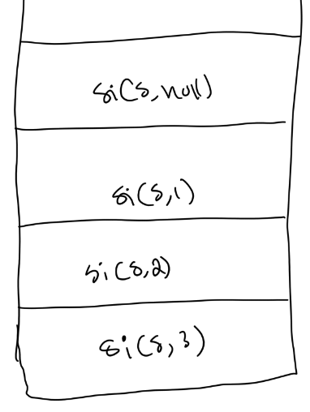

### $1.-$ What is the difference between a stack and a queue?

$A:$

We can only remove an element from the queue by removing the first element, whereas in a stack we can only remove an element from the back.

### $2.-$ How would you implement a queue in Ruby?

$A:$

I could use an array like this

```ruby
class Queue
  def initialize
    @elements = []
  end

  def enqueue(item)
    @elements.push item
  end

  def dequeue
    @elements.shift
  end

  def empty?
    @elements.empty?
  end
end
```

however, while that does feel like a queue, the time complexity of its operations is different from that of a true queue. The `enqueue` and `dequeue` operations are supposed to be O(1), however pushing an item to an array only averages O(1), but if the array is full the elements have to be moved to a larger memory slot with more space, which makes it not truly O(1). Similarly, removing an element from an array is O(n) as all previous elements have to be shifted by one.

A queue would be best implemented as a linked list. There's a `front` and `back` properties of the `Queue`. Those are first initialized to `nil`, then when we first enqueue something, we create a `Node`. Both `front` and `back` point to this node. To enqueue something else we create a new `Node`, set its `next` to `back`, and `back` to this new node.

To dequeue something we set `front` to its `prev`. We set the new `front`'s `next` to `nil`. So the linked list has to be doubly linked.

```ruby
# Node
class Node
  attr_accessor :data, :succ, :pred

  def initialize(data, succ, pred)
    @data = data
    @succ = succ
    @pred = pred
  end
end

# Queue
class Queue
  def initialize
    @front = nil
    @back = nil
  end

  def enqueue(item)
    return add_first_node item if @front.nil?

    node = Node.new item, @back, nil

    @back.pred = node
    @back = node
  end

  def dequeue
    return handle_single_item_case if @front == @back

    node = @front
    pred = node.pred

    node.pred = nil
    pred.succ = nil

    @front = pred

    node.data
  end

  def empty?
    @front.nil?
  end

  def to_s
    str = ''
    node = @front

    until node.nil?
      str += "#{node.data}, "

      node = node.pred
    end

    str
  end

  private

  def add_first_node(item)
    node = Node.new item, nil, nil

    @front = node
    @back = node
  end

  def handle_single_item_case
    data = @front&.data

    @front = nil
    @back = nil

    data
  end
end
```

### $3.-$ What is a linked list? What is a node?

$A:$

A node is an object that has two things; data, and links to other nodes. A linked list is a chain of nodes where each node is connected to the next one in the chain, and optionally to the previous one as well.

### $4.-$ Which recursive problem-solving method/algorithm design principle does binary search implement?

$A:$

Breaking down the main problem into simpler ones. We reduce the search space by half for every iteration.

```ruby
def check_last_item(item, &test)
  item if item.nil? || test.call(item).zero?
end

def search_rest(array, item, midpoint, result, &test)
  if result == -1
    binary_search array[(midpoint + 1)..array.size], &test
  elsif result == 1
    binary_search array[0...midpoint], &test
  else
    item
  end
end

def binary_search(array, &test)
  return check_last_item(array[0], &test) if array.size <= 1

  midpoint = array.size / 2
  item = array[midpoint]
  result = test.call item

  search_rest array, item, midpoint, result, &test
end
```

### $5.-$ What abstract data type would you use to defer/store nodes in a breadth-first tree traversal?

$A:$

A queue. Assume we have the following tree.


We initialize a queue. We put the root in the queue, then while the queue is not empty we dequeue the element at the front, and queue that element's children.

This is how every iteration looks like

```
queue = [ 3 ]

node = queue.dequeue
visit node => 3
queue.enqueue node.children

queue => [ 2, 7 ]
visit output => 3,
```

```
node = queue.dequeue => 2
visit node => 2
queue.enqueue node.children

queue => [ 7, 1 ]
visit output => 3, 2
```

```
// rest of the fucking...

queue => [ 1, 5, 12 ]
visit output => 3, 2, 7
```

```
// rest of the fucking...

queue => [ 5, 12 ]
visit output => 3, 2, 7, 1
```

```
// rest of the fucking...

queue => [ 12, 4, 6 ]
visit output => 3, 2, 7, 1, 5
```

```
// rest of the fucking...

queue => [ 4, 6, 10 ]
visit output => 3, 2, 7, 1, 5, 12
```

the remaining nodes have no children, so the final output is

```
3, 2, 7, 1, 5, 12, 4, 6, 10
```

A quick implementation showing how we can use a queue is below.

```ruby
# Node
class BNode
  attr_accessor :data, :left, :right

  def initialize(data)
    @data = data
    @left = nil
    @right = nil
  end
end

# Binary Search Tree
class Beast
  def initialize
    @root = nil
  end

  def append(data)
    return @root = BNode.new(data) if @root.nil?

    node = @root

    loop do
      node = add_node data, node

      break if node.nil?
    end
  end

  def breadth_first_search(&test)
    queue = Queue.new

    queue.enqueue @root

    until queue.empty?
      node = queue.dequeue
      data = node.data

      return data if test.call data

      queue.enqueue node.left unless node.left.nil?
      queue.enqueue node.right unless node.right.nil?
    end
  end

  private

  def add_node(data, node)
    if data < node.data
      if node.left.nil?
        node.left = BNode.new data

        nil
      else
        node.left
      end
    elsif node.right.nil?
      node.right = BNode.new data

      nil
    else
      node.right
    end
  end
end
```

### $6.-$ What abstract data type would you use to defer/store nodes in a depth-first tree traversal?

$A:$

A stack. Consider the tree we've been working with


We conventionally search the left subtree before the right one when doing depth first search. Then there are three ways of doing the search

```
<root><left><right> => preorder
<left><root><right> => inorder
<left><right><root> => postorder
```

What would visiting our tree with each order look like?

#### Preorder

We first visit the root, then the left subtree, and then the right one.

```
3, 2, 1, 7, 5, 4, 6, 12, 10
```

#### Inorder

We first visit the left subtree, then the root, and then the right one.

```
1, 2, 3, 4, 5, 6, 7, 10, 12
```

#### Postorder

We visit the left subtree, then the right one, and finally the root.

```
1, 2, 4, 6, 5, 10, 12, 7, 3
```

---

We don't need to write an explicit data structure like we did with `Queue`, we can use recursion, so the call stack would be our stack.

We can add the following method to traverse a tree inorder.

```ruby
class Beast
  # rest of the fucking...

  def inorder_traverse &visit
    _inorder_traverse @root, &visit
  end

  private

  def _inorder_traverse node, &visit
    return if node.nil?

    _inorder_traverse node.left, &visit

    visit.call node.data

    _inorder_traverse node.right, &visit
  end

  # rest of the fucking...
end
```

how do we actually return a match? This doesn't seem to work

```ruby
class
  # rest of the fucking...

  def _inorder_traverse node, &test
    return if node.nil?

    _inorder_traverse node.left, &test

    return node.data if test.call node.data

    _inorder_traverse node.right, &test
  end
end
```

I don't know if it's possible to refactor that method to actually work without destroying it's recursive beauty, and beauty is often all recursive methods have, since they tend to be wasteful in terms of memory, so in that case it would be better to refactor it into an iterative version that uses a stack.

How would such implementation look like? Let's do inorder first.

How do we stack the nodes to get them back inorder order? I think it would be easier to first stack all the nodes, and then pop them back.

First I need a way to build a stack.

I have a node. I push its left child to the stack, then the node itself, and then its right child.

Would this work?

```
stack_inorder(stack, node) {
  return if node.null?

  stack_inorder stack, node.left

  stack.push node

  stack_inorder stack, node.right
}
```

Assume we have our tree


and we call `stack_inorder(stack, 3)`, this call will itself call `stack_inorder(stack, 2)`, and so on



At this point we haven't pushed anything to `stack` yet.

Then the top context matches `node.null?`, so it is popped immediately, and the execution of `stack_inorder(stack, 1)` resumes. This causes the node `1` to be pushed to the stack. Then there's another recursive call where the `node` is `null`, so it also pops back out immediately. Since this is the last step in `s(1)`, we pop it out as well.

At this point the stack is

```
s = [1]
```

After popping out `s(1)`'s context we go back to `s(2)`'s, and we push `2` to the stack, and call `s(null)` as the final step of `s(2)`. We pop that out, and `s(2)`'s context.

After that we resume `s(3)`'s execution, which pushes `3` to the stack, so the stack looks like this

```
s = [1, 2, 3]
```

We only went down two nodes, but the path already looks like this


we can imagine what happens next. The next step in `s(3)` is calling `s` on the right subtree, so we pop `s(7)` into the stack. `s(7)` causes `s(5)` to be pushed into the call stack, which in turn pushes `s(4)`. `s(4)` pushes `s(null)`, which gets popped out immediately, then we resume `s(4)`'s execution, which pushes `4` into our stack, leaving it as

```
s = [1, 2, 3, 4]
```

`s(4)` resumes, pushing `s(null)`, then we pop them both out, resuming `s(5)`, which pushes `5` into our stack, and then calling `s(6)`, which after getting popped out leaves our stack as

```
s = [1, 2, 3, 4, 5, 6]
```

At this point it should be clear that the function works.


So we can stack the nodes inorder, now we just need to pop them out.

```
inorder_search(test) {
  stack = new Stack

  this.stack_inorder stack, this.root

  until stack.empty? {
    { data } = stack.pop

    return data if test data
  }
}
```

According to ClaudeGrokPT that's not quite right. The nodes are checked in reverse order, which is apparently different from inorder. There's also the issue that we traverse the entire tree before performing the search. The traversal is O(n), but searching a binary search tree should be O(log(n)) on average according to [bigocheatsheet.com](https://www.bigocheatsheet.com).


This should fix it
```
inorder_search(test) {
  stack = []
  node = this.root

  until node.nil? && stack.empty? {
    while node {
      stack.push node
      node = node.left
    }

    node = stack.pop

    data = node.data
    
    return data if test data

    node = node.right
  }
}
```