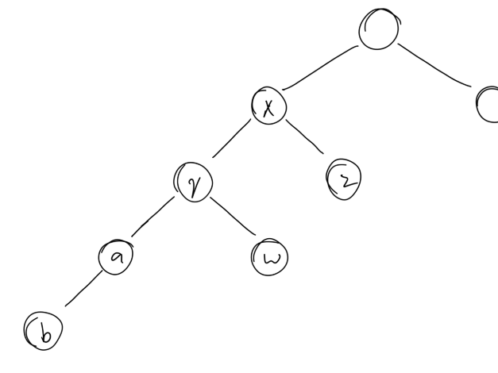
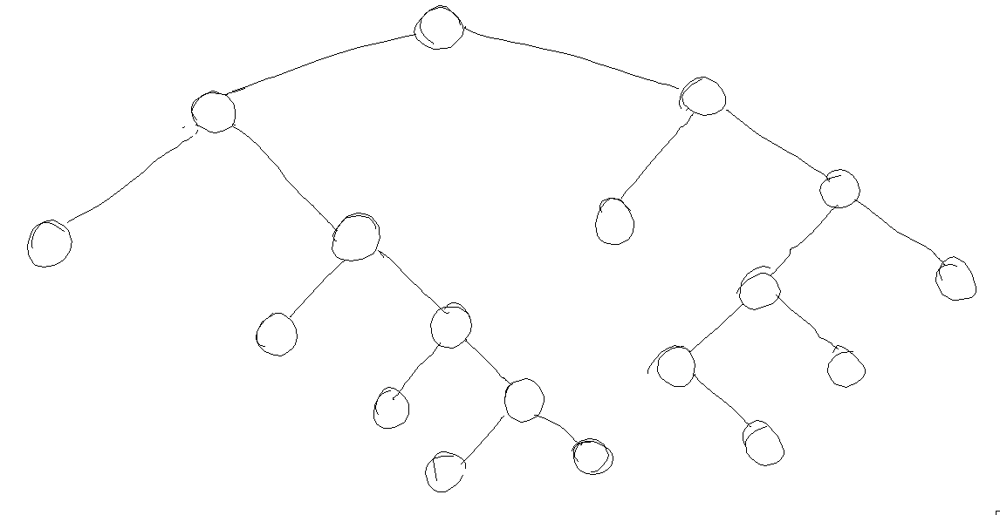

# Binary Search Tree

## `find`

How do I find something? I have a value, until something happens, like a variable being `null`, I compare the value of the variable to the value and do some stuff.

More specifically

```
find(value) {
  node = @root

  until node.null? {
    if node.value == value
      return node
    else if value < node.value
      node = node.left
    else
      node = node.right
  }
}
```

## `level_order`

How do I handle the requirement that the method should return an array of values. What should it return if it is given a block? Probably `null`, so I think I can do this

```
level_order(cb) {
  values = cb.null? ? [] : null
  queue = new Queue

  queue.enqueue this.root

  until queue.empty? {
    node = dequeue
    value = node.value

    cb.call value unless cb.null?
    values.push value unless values.null?

    queue.enqueue node.left unless node.left.null?
    queue.enqueue node.right unless node.node.right.null?
  }

  values
}
```

## `preorder`/`inorder`/`postorder`

I can easily write a method that takes a block and applies it to the elements in the given order. WLOG let's consider `inorder`.

```
inorder(node, cb) {
  return if node.nil?

  inorder node.left, cb

  cb.call node.value

  inorder node.right, cb
}
```

but what about the requirement of returning an array of values if no block is given?

I think I can do something like

```
inorder_helper(node, cb) {
  return if node.null?

  inorder_helper node.left, cb

  cb.call node.value

  inorder_helper node.right, cb
}

inorder(cb) {
  values = cb.null? ? [] : null
  block = cb.null? ? (v) => values.push v : cb

  inorder_helper this.root, block

  values
}
```

## `height`

I can get the node with the `find` method. What next?

Assume we have the tree


and we need to find the height of `x`.

The given node has two children; left and right, so its height is maximum height of either plus one.

Let's look at its right child. `z`'s height is one plus the maximum of whichever of its children is the highest. Since both of `z`'s children are dead, they both ought to return -1 to cancel out `z`'s +1.

I wonder if this would work

```
depth(node) {
  return -1 if node.null?

  1 + Math.max(depth(node.left), depth(node.right))
}

height(value) {
  node = this.find value

  return 0 if node.null?

  depth node
}
```

It seems to. I just need to change the name of `depth` to something else, since I have to implement a public `depth` method.

## `depth`

I'm at the root, and I want to find how long is the path to a node that has a given element. My first idea is to use breadth first search to keep track of how deep a node is, something like this

```
depth(value) {
  cute = Queue.new

  cute.enqueue { node: this.root, depth: 0 }

  until cute.empty? {
    { node, depth } = cute.dequeue

    return depth if value == node.value

    left = { node: node.left, depth: depth + 1 }
    right = { node: node.right, depth: depth + 1 }

    cute.enqueue left unless node.left.null?
    cute.enqueue right unless node.right.null?
  }
}
```

It seems to work, however it looks a lot like the existing `level_order` method. Is there any other way? I tried, but since I can't spend too much time on this I have to cave in and look it up. A suggested solution from the internet is

```js
function findDepth(root, x) {
  if (!root) return -1;

  let dist = -1;

  if (
    root.data === x ||
    (dist = findDepth(root.left, x)) >= 0 ||
    (dist = findDepth(root.right, x)) >= 0
  ) {
    return dist + 1;
  }

  return dist;
}
```

## `balanced?`

The tutorial warns againts just checking the difference between the heights of the left and right subtrees. It makes sense if we look at the picture below, where the heights of the left and right subtrees are the same, but the tree is definitely not balanced.



Then what? For every node, check if the difference between the heights of its left and right subtrees is more than one, if so, return false.

```
balanced_helper(node) {
  return true if node.null?

  left = this.height node.left
  right = this.height node.right
  diff = Math.abs(left - right)

  return false if diff > 1

  balanced_helper(node.left) &&
    balanced_helper(node.right)
}

balanced?() {
  this.balanced_helper this.root
}
```
