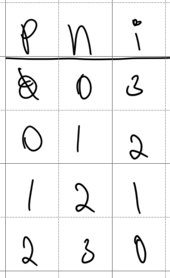
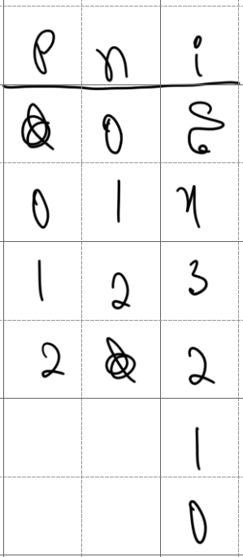
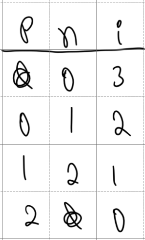
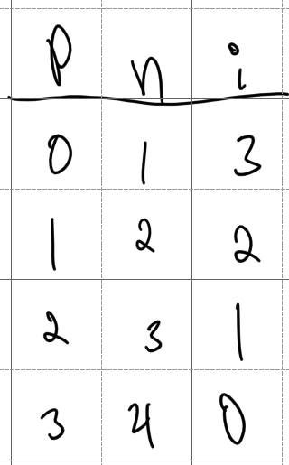

# Linked List

## `append`

I got something wrong. I had

```
sneed(value) {
  this.head = new Node value, null
}

append(value) {
  return sneed value if this.head.null?

  node = @head

  node = node.next until node.next.null?

  newNode = new Node value, null

  node.next = newNode
}
```

I want to get the last node, make a new node, and set the last node's `next` to this new node. There's a `tail` method which is supposed to return this last node, but it retrieves the last node with the same logic, so it's also wrong.

```
tail() {
  node = this.head

  node = node.next until node.next.null?

  node
}
```

Looking a bit closer, it looks like I didn't read the error message correctly, I just skimmed it, and assumed it had something to do with accessing a value on `null`, but I never made the node properties accessible.

## `pop`

If the current node's `next` is null, then this is the last element, and I should remove it. I remove it by setting its parent's `next` to `nil`. So I need to keep track of the current node and its parent.

```
pop() {
  parent = null
  node = this.head

  until node.next.nil? {
    parent = node
    node = node.next
  }

  parent&.next = null
  node.data
}
```

Would this work? Assume there are ten nodes

```
{ 0 } -> { 1 } -> { 2 } -> { 3 } -> { 4 } -> { 5 } -> { 6 } -> { 7 } -> { 8 } -> { 9 } -> null
```

`node` is initialized to `{ 0 }`, and `parent` to `null`. The condition is true when

```
parent = { 8 }
node = { 9 }
```

it works I guess. That would work down to two nodes.

What if there's one singular node?

```
{ 0 } -> null
```

The variables end up with the values

```
parent = null
node = { 0 }
```

It doesn't pop the node out. Why did I decide to initialize the parent as `null`, and the `node` with `head`? I think it was arbitrary. What about this?

```
pop() {
  parent = this.head
  node = parent.next

  until node&.next_node.nil? {
    parent = node
    node = node.next
  }

  parent&.next = null
  node&.data
}
```

It works with two nodes and above. What about one? With one single node the variables end up as

```
parent = { 0 }
node = null
```

the list should be emptied, but it isn't. We need to add a check like

```
this.head = null if parent == this.head
```

It should work with zero nodes.

## `insert_at`

I can loop until the `index` is zero, or `node` is null. Something like this

```
insert_at(value, index) {
  parent = null
  node = this.head

  until index.zero? {
    parent = node
    node = node.next

    index--
  }

  newNode = new Node value, node
  parent.next = newNode
  newNode.next = node
}
```

Assume we have the list

```
{ 0 } -> { 1 } -> { 2 } -> { 3 } -> { 4 } -> { 5 } -> null
```

and want to insert a value at index 3. Here's the iterations



what if the index is out of bounds? should this work if the user asks to insert something at the end of the list, like after the `{ 5 }` node in the example above?

we can't keep on advancing if `node` is `null`, so we can add `node.null?` to the loop check.

Assume we have the list

```
{ 0 } -> { 1 } -> { 2 } -> null
```

and we want to insert something at index 5.



we can't go below 2. After that we ask if `index.zero?` if not, then we broke because the index was out of bounds, and we throw an error.

Now consider



Rather than checking if `node` is `null` and `index` is not `zero`, we can just check if `node` is null, and don't append if that's the case. Then the answer to the second question is that we don't allow appending just outside the list.

The method is currently

```
insert_at(value, index) {
  parent = null
  node = this.head

  until node.null? || index.zero? {
    parent = node
    node = node.next

    index--
  }

  throw new Error("index out of bounds!") if node.null?

  newNode = new Node value, node

  parent.next = newNode
  newNode.next = node
}
```

Assume you have the list

```
{ 0 } -> { 1 } -> { 2 } -> { 3 } -> { 4 } -> { 5 } -> null
```

and want to insert something at index zero. The `head` instance variable of the `List` is not updated. Can it be fixed by setting `parent` to `head` at first like with `pop`? Assume we do that, and want to insert something at index three, changing only the initialization of the `parent` and `node` variables we get



but we need to know the predecessor of `parent`, so this just makes things more complicated.

An easy solution is to call `prepend` when the given index is zero.

## `remove_at`

```
remove_at(index) {
  shift if index.zero?

  parent = null
  node = this.head

  until node.null? || index.zero? {
    parent = node
    node = node.next

    index--
  }

  throw new Error("index out of bounds") if node.null?

  parent.next = node.next
  node.next = null
}
```
